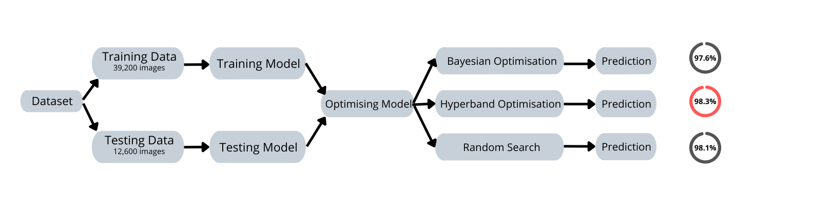
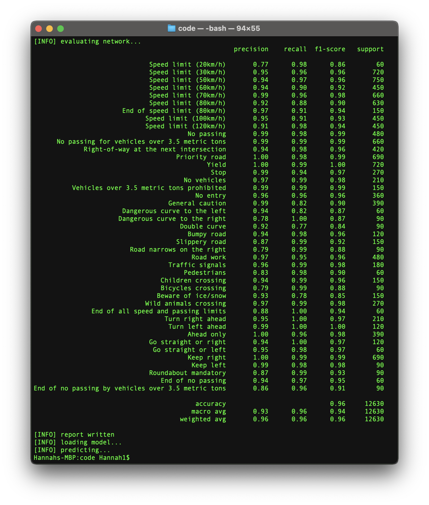

# Extended Traffic Sign Classification with GTSRB

This repository provides the full framework for a neural network that will classify given traffic signs.

## Overview

The folder `code` will offer the neccessary functions and methods needed in order to build, train, test, and optimise the neural network. The folder will also provide space for the data collected of the different optimisation methods.

The folder `gtsrb` consists of three folders and three label documents that form the entire dataset. This dataset can be extended for applications outside of Germany.

The folder `log` entails all logs collected through the different training and testing stages of the neural network. They can be used to analyse and evaluate the performance in TensorBoard.

The `output` folder consists of the saved models. As there are four different models (one without optimisation, and three with optimisation) it is necessary to separate them. With the final accuracy of over 98%, the hyperband model can be implemented immediately.

The predicted images will be loaded into the folder `predictions`.

Lastly, the folder `reports` stores all results of training and testing stages.

## Preparations

The file `preparations.md` describes all necessary steps to create the correct working environment that ensure the functionality of this framework.

The file `run_code.md` provides a manual on how to use this framework, once all prerequisites are met.

The basic functionality of the framework is visualised in the image below:

Testing the model, the accuracies of recognising each traffic sign can be seen below:

